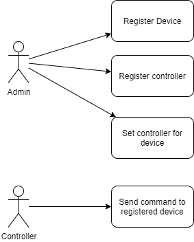
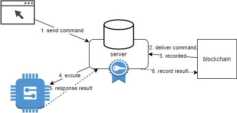
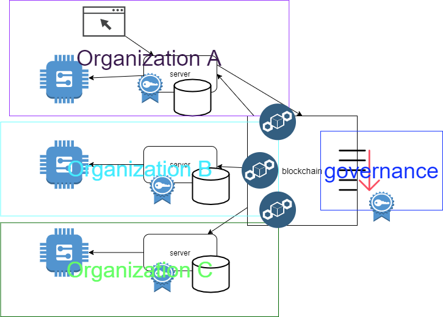
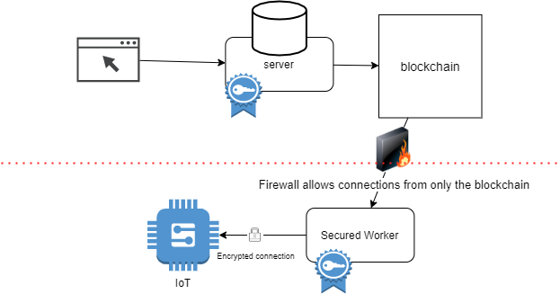

# iot-manager
This is a nodejs project based on hyperledger farbic, used to manage controllers and their iot devices.

## USE CASE

The purpose of the project is to develop a reliable environment to control IoT devices. The private blockchain brings two benefits.  Firstly, the blockchain protects the devices from hacked by others, as all the commands must pass through the blockchain and be validated by multiple peers. Secondly, due to blockchain’s immutability and finality, the operation history will be stored on-chain forever, which will clearly indicate the liability for every employee. 

## ARCHITECTURE

Currently it is still a MVP, including only one orgnization, but it has the protential to extend among multiple orgnizations to share controll and data meanwhile allowing different permissions for different roles. By doing this, companies can supervise each other and broadcast the right commands to devices across parties.

We could also split the command event listener from the main api server, and set the security group rules to block all outter requests, and use synchronous encryption between securied woker and the IoT devices.

## Instruction
1. Install the hyperledger fabric. [Tutorial](https://hyperledger-fabric.readthedocs.io/en/release-2.2/getting_started.html). I have copied most used scripts to ./myscript.sh
2. Run the admin scripts to register admin and generate user wallets.
3. Move the wallets to iotapi and install the libraries.
4. Install a mongodb and config the url in iotapi/index.js.
5. Create the fisrt admin user for the api. However, I did not provide and endpoint to register admin. So you can use my code in iotapi/test.js to generate the username and password, and then manually insert to the mongodb, and change its role to admin, or you could create extre endpoints. 
6. Install latest postman and import my json endpoint records.
7. Sign in with admin and reuse the JWT from response for rest operations.
