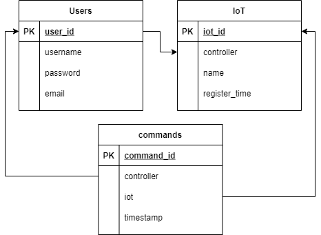

# iot-manager API
This is the backend for the iot-manager. To avoid issue too many CAs for each controllers, I determined to use traditional database to store users, and command logs. Only key information is stored on-chain, which is the iots and their mapping to controller. For this MVP, the main task is to guarantee the command is from the controller.

## Database

In current state, only the user is stored in MongoDB, as the other information can be found from blocks. But to relieve the presure on blockchain, we need to store them in our database too.

## API Docs
Please refer the postman josn file under frontend folder.

## Essential Part
This is jsut a small expressjs backend project. To save your time, if you only want to learn about hyperledger fabric, just refer the /services folder, which includes all interactions to the blockchain. I copied part of the code from the official fabcar example and simplified them. Also I left their part commented out, for you to compare.